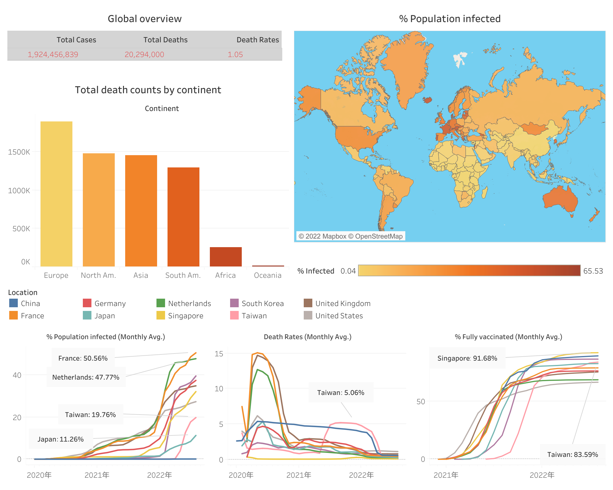

# Covid19: a project for practicing my SQL + Tableau
The world is becoming more and more open for traveling. To help people understand the current pandemic situation around the world, I collect and visualize the covid19 data.

## How I get and process the data
1. The data was first downloaded from [Data source](https://ourworldindata.org/covid-deaths) and saved into as csv files.
2. The downloaded csv files then were imported into SQL data base by [Azure SQL EDGE](https://azure.microsoft.com/en-us/products/azure-sql/edge/) with the import wizard.
3. All data cleaning and processing steps were performed by [SQL](SQLQuery_portfolio).
4. The cleaned SQL tables then were output into excel files and visualized by [Tableau](https://public.tableau.com/app/profile/tsunghan.hsieh/viz/covid19_16606524256070/1).
5. The SQL is run by [Azure SQL edge] (https://azure.microsoft.com/ja-jp/products/azure-sql/edge/#product-overview) on Mac using [docker](https://www.docker.com/).
6. The IDE is [Azure Data Studio](https://docs.microsoft.com/en-us/sql/azure-data-studio/download-azure-data-studio?view=sql-server-ver16).

## The files are organized as the following structure
```
github.com/pocession/sql_portfolio/
├── Data: csv files for input data
│   ├── *.csv
├── Output : csv files for output data, used for Tableau
│   ├── *.xlsx
├── SQLQuery_portfolio.sql: the SQL command lines for processing the input data
├── SQLQuery_tutorial.sql: a test files of SQL command lines, not used in this project
├── readme.md
├── sql_tableau_covid.png: a screen shot of the data visualization
```

The unprocessed input data file is stored in the following folder, `Data`.

The processed data is provided in 'csv' formats and stored in the follwoing folder, `Output`.

## Useful links
- [Data source](https://ourworldindata.org/covid-deaths)
- [Data cleaning](SQLQuery_portfolio)
- [Tableau](https://public.tableau.com/app/profile/tsunghan.hsieh/viz/covid19_16606524256070/1)



